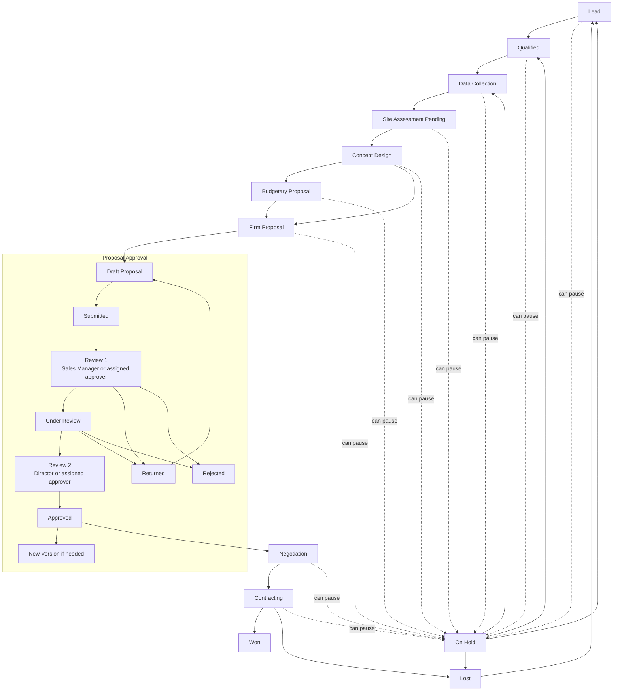
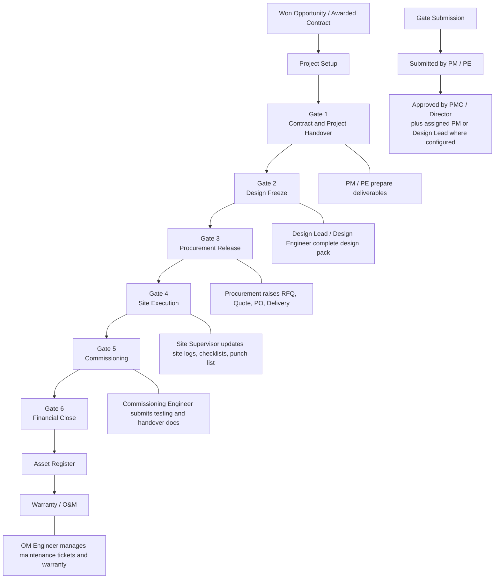

# CRM Workflow And Role Matrix

**Last reviewed:** 2026-05-08

This document reflects the current CRM design and RBAC as implemented in code, based on:

- `packages/db/src/seeds/permissions.seed.ts`
- `apps/web/src/lib/role-ui.ts`
- `packages/workflows/src/index.ts`
- `apps/api/src/modules/proposals/proposals.service.ts`
- `docs/v1-product-direction.md`
- `docs/pmo-v1-direction.md`

It is intentionally practical rather than exhaustive. The role notes below summarize what each role can and cannot do in day-to-day operation.

## Sales workflow with manual activity logging (2026-05-08)

The full sales workflow now reads:

```
Account → Contact → Site → Opportunity → Activity / Next Action → Proposal → Contract → Project
```

Notes on the **Activity / Next Action** stop:

- Activities are **manual CRM records**: call, email, WhatsApp, meeting, site visit, proposal follow-up, general note.
- Activities **do not connect** to any external channel in V1 — no email, WhatsApp, telephony, calendar, or AI integration. Salespeople perform the action outside the CRM and then log it.
- **Next Action** (type, owner, due date) is the primary sales discipline tool. Every open opportunity should have one and only one open next action.
- **Overdue** (next-action due-date in the past) and **Stale** (no activity in 14/30 days) opportunities are surfaced through opportunity-list filters, the sales pipeline dashboard, and in-app notifications. They are the main signal for management chase.

The original lifecycle diagram below covers the full project lifecycle from win through O&M; this Activity / Next Action layer sits inside the "Opportunity → Proposal" segment.

## Scope Legend

- `all`: full access across the portfolio
- `team`: access within the role's team
- `own`: access to records created or owned by the user
- `assigned`: access only to records the user is explicitly assigned to

## Workflow Diagrams

### 1. End-to-End CRM Lifecycle

```mermaid
flowchart LR
    A[Account] --> B[Contact]
    A --> C[Site]
    C --> D[Opportunity]
    D --> E[Site Assessment / Technical Assessment]
    E --> F[Proposal / Proposal Version]
    F --> G[Commercial Approval]
    G --> H[Contract Award]
    H --> I[Project Created]
    I --> J[Gate 1<br/>Contract Handover]
    J --> K[Gate 2<br/>Design Freeze]
    K --> L[Gate 3<br/>Procurement Release]
    L --> M[Gate 4<br/>Site Execution]
    M --> N[Gate 5<br/>Commissioning]
    N --> O[Gate 6<br/>Financial Close]
    O --> P[Asset Register]
    P --> Q[O&M / Maintenance]
```



### 2. Commercial Workflow



### 3. Project Delivery Workflow



### 4. Swimlane Workflow By Function

```mermaid
flowchart LR
    subgraph Sales["Sales"]
      S1[Account / Contact / Site setup]
      S2[Opportunity creation and stage progression]
      S3[Proposal drafting and submission]
      S4[Negotiation and contracting]
    end

    subgraph Design["Design"]
      D1[Site assessment]
      D2[Technical assessment]
      D3[Concept / firm design]
      D4[Drawing pack and Gate 2 inputs]
    end

    subgraph Project["Project Delivery"]
      P1[Project setup]
      P2[Gate 1 submission]
      P3[Milestones / risks / issues]
      P4[Gate 4 site execution]
      P5[Gate 5 commissioning]
      P6[Gate 6 financial close]
    end

    subgraph Procurement["Procurement"]
      R1[RFQ]
      R2[Quote]
      R3[Purchase order]
      R4[Delivery]
    end

    subgraph Site["Site / Commissioning"]
      C1[Site logs]
      C2[Checklists]
      C3[Punch list]
      C4[Testing sheets]
      C5[Handover docs and asset register]
    end

    subgraph PMO["PMO / Governance"]
      G1[Portfolio monitoring]
      G2[Gate oversight]
      G3[Risk and milestone escalation]
      G4[PMO reporting]
    end

    subgraph Finance["Finance"]
      F1[Contract record]
      F2[Invoice milestones]
      F3[PO approval and cost visibility]
      F4[Payment status and reporting]
    end

    subgraph OM["O&M"]
      O1[Warranty record]
      O2[Maintenance ticket]
      O3[Post-handover support]
    end

    S1 --> S2 --> D1 --> D2 --> D3 --> S3 --> S4 --> F1 --> P1 --> P2
    D3 --> D4 --> P3
    P3 --> R1 --> R2 --> R3 --> R4 --> P4
    P4 --> C1 --> C2 --> C3 --> C4 --> C5 --> P5 --> P6
    P6 --> F2 --> F4
    F2 --> F3
    C5 --> O1 --> O2 --> O3

    P2 --> G2
    P3 --> G1
    P3 --> G3
    P6 --> G4
```



## Role Capability Summary

### SUPER_ADMIN

- Workspace: admin area only.
- Can: manage users, roles, and platform administration.
- Cannot: run commercial, project delivery, procurement, site execution, commissioning, finance, or O&M business workflows unless separately given a business role.

### DIRECTOR

- Workspace: full business portfolio across dashboard, CRM, PMO, procurement, documents, O&M, and reports.
- Can: view, create, edit, submit, approve, and export almost every business object across the portfolio; approve contracts, gates, technical documents, procurement artifacts, and financial controls; view sensitive values such as contract value, CAPEX, margin, cost, and payment status.
- Cannot: use user and role administration, which remains exclusive to `SUPER_ADMIN`.

### PMO_MANAGER

- Workspace: dashboard, projects, PMO, documents, and reports.
- Can: view the full project portfolio; edit projects and gates; approve all gates; create and edit milestones, issues, and risks; view procurement and proposal context for governance; export reporting.
- Cannot: own the sales pipeline, create or edit accounts, create proposals, approve contracts, approve purchase orders, or see sensitive finance fields such as margin, cost, or payment status.

### SALES_MANAGER

- Workspace: dashboard, accounts, contacts, sites, opportunities, proposals, documents, and reports.
- Can: manage the team's accounts, contacts, sites, opportunities, proposals, and proposal versions; submit and approve team commercial work; view pipeline value, estimated margin, contract value, project summaries, and team reporting.
- Cannot: administer users and roles, approve project gates, run procurement, approve finance artifacts, or execute site / commissioning / O&M workflows.

### SALES_ENGINEER

- Workspace: dashboard, accounts, contacts, sites, opportunities, proposals, and documents.
- Can: create and manage own accounts, contacts, sites, opportunities, proposals, proposal versions, and site assessments; submit own opportunities and proposals; view own estimated margin and own reporting.
- Cannot: approve proposals, approve opportunities, access portfolio-wide reporting, manage projects, approve gates, run procurement, edit finance objects, or work site / commissioning / O&M execution records.

### PROJECT_MANAGER

- Workspace: dashboard, projects, PMO, documents, and reports.
- Can: manage assigned projects; edit and submit assigned gates; approve assigned gates; create and edit assigned milestones, issues, and risks; create, edit, submit, approve, and export assigned documents; view assigned opportunity, proposal, site, contact, contract, invoice milestone, cost, procurement, site, commissioning, and asset records; export assigned reporting.
- Cannot: create or edit accounts and opportunities, approve contracts, see portfolio-wide finance by default, manage user admin, or perform procurement ownership tasks such as creating RFQs and POs.

### PROJECT_ENGINEER

- Workspace: dashboard, projects, and documents.
- Can: edit assigned projects; edit and submit assigned gates; create and edit assigned milestones and issues; create and view assigned risks; create, edit, submit, and export assigned documents; view assigned opportunities, proposals, contacts, sites, procurement records, site records, and assigned reporting.
- Cannot: approve gates, approve documents, approve procurement artifacts, access accounts workspace, approve finance objects, or run O&M-only workflows.

### DESIGN_LEAD

- Workspace: dashboard, opportunities, proposals, projects, documents, PMO, and reports.
- Can: view the full design-relevant portfolio; create, edit, submit, and approve documents, drawings, and technical assessments; create and edit site assessments, issues, and risks across the portfolio; approve assigned gates; view reporting and project delivery health.
- Cannot: own account/contact/site master data, approve contracts or invoices, create purchase orders, or run site supervision / commissioning / O&M execution workflows.

### DESIGN_ENGINEER

- Workspace: dashboard, opportunities, projects, and documents.
- Can: view assigned opportunities, proposals, projects, sites, documents, drawings, milestones, issues, and risks; create, edit, and submit assigned drawings, documents, technical assessments, and site assessments; view assigned procurement context and reporting.
- Cannot: approve drawings, approve documents, approve gates, create opportunities or proposals, edit commercial values, approve finance artifacts, or run site supervision / O&M workflows.

### PROCUREMENT

- Workspace: dashboard, projects, procurement, and documents.
- Can: create, edit, submit, and view assigned RFQs, quotes, purchase orders, and deliveries; create and edit vendors; view assigned projects, sites, documents, and reporting; view all vendors and all accounts for sourcing context.
- Cannot: approve gates, approve contracts, approve invoice milestones, approve proposals, edit project execution records, or manage O&M workflows.

### SITE_SUPERVISOR

- Workspace: dashboard, projects, documents, and O&M shortcut pages.
- Can: view assigned projects and sites; create and edit site logs, checklists, and punch lists; create issues; create project documents; view assigned deliveries and reporting.
- Cannot: approve gates, approve documents, submit commissioning packs, manage finance, create procurement records, or approve project closeout artifacts.

### COMMISSIONING_ENGINEER

- Workspace: dashboard, projects, documents, and O&M shortcut pages.
- Can: view assigned projects and sites; create and edit checklists, punch lists, testing sheets, handover documents, assets, warranty records, and project documents; submit commissioning and handover packs; view drawings, site logs, and reporting.
- Cannot: approve gates, approve contracts, approve finance artifacts, create procurement records, or manage upstream commercial workflow.

### OM_ENGINEER

- Workspace: dashboard, O&M, projects, and documents.
- Can: manage assigned maintenance tickets and warranty records; edit assigned assets; view handed-over projects, sites, drawings, documents, testing sheets, handover docs, and reporting.
- Cannot: create or edit pre-handover project controls, approve gates, create procurement records, manage sales pipeline, or approve finance artifacts.

### FINANCE_ADMIN

- Workspace: dashboard, reports, projects, and documents.
- Can: view the full portfolio for financial oversight; create, edit, and export contracts; create, edit, approve, and export invoice milestones; approve and export purchase orders; view contract value, margin, cost, payment status, assets, warranty, maintenance, and full reporting.
- Cannot: use user admin, manage opportunity or proposal creation, approve project gates, edit site execution records, or own technical delivery workflows.

## Practical Reading Notes

- Sidebar access and backend permission are related but not identical. Some roles have backend read access to linked records without having a dedicated sidebar module for that area.
- Commercial visibility is intentionally narrower than workflow visibility. A role may view a proposal or project without seeing CAPEX, margin, or payment data.
- `DIRECTOR` is the broadest business role, but `SUPER_ADMIN` is still the only platform admin role.
- `PROJECT_ENGINEER` is intentionally a contributor role, not an approver role.
